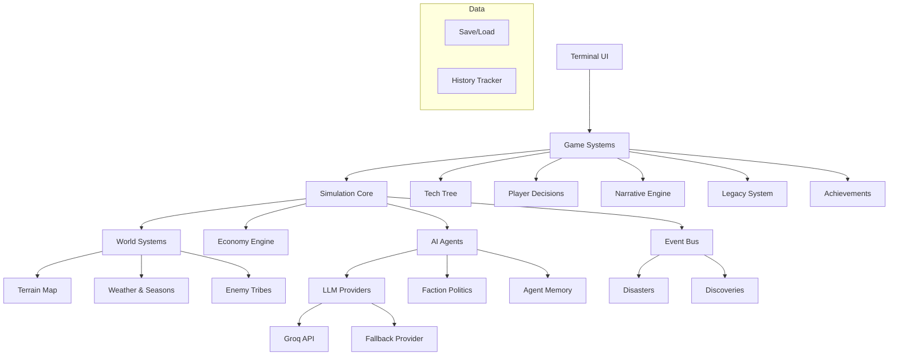

<h1 align="center">🏛️ Civilization Engine</h1>

<p align="center">
  <strong>v1.0</strong> — <em>Multi-agent AI civilization simulator for the terminal</em>
</p>

<p align="center">
  
  
  
  
</p>

```
  +------------------------------------------+
  |         CIVILIZATION ENGINE v1.0         |
  |    AI agents . Interactive . Terminal    |
  +------------------------------------------+

  Year 8/20    Bronze Age    Summer
  Pop: 134     Discoveries: 3

  Kael . Doren . Mira . Thane . Elara

  Food  ###########..  84
  Wood  ####........   42
  Stone ######......   63

  Innovators  24    Scholars  19
  Builders    14    Threat    55%

  + Agriculture discovered
  ! Raid -- Grey Wolves attack! Lost 8
  > Kael asks: "Can we channel the river?"
```

## Overview

**Civilization Engine** is an interactive simulation where five AI agents — each with unique personalities, expertise, and goals — build a society from scratch. You don't just watch. Every few years, you sit on the Council of Elders and make decisions that shape your civilization's fate.

Will you invest in agriculture to stave off famine? Fortify defenses against raiding tribes? Fund research to discover bronze-working? Or crush a rival faction before they grow too powerful?

Your choices echo across generations.

## Quick Start

```bash
# Clone and install
git clone https://github.com/sciencebanda09/Civilization-Engine.git
cd Civilization-Engine
npm install

# Play with the interactive scenario picker
npm run play

# Or launch directly with a scenario and epoch count
npm run play -- peaceful_valley 10
```

No API keys required. The simulation runs out of the box with a built-in fallback provider.

---

## Gameplay

### The Simulation Loop

Each **epoch** (year) advances your civilization through four phases:

1. **Economy** — Resources are produced and consumed. Population grows or starves.
2. **Disasters** — Floods, droughts, plagues, raids, and earthquakes can strike at any moment.
3. **Agent Actions** — AI agents triage, form teams, debate hypotheses, and make discoveries.
4. **Faction Update** — Influence shifts based on events and agent reputations.

### Interactive Decisions

The simulation pauses for you at critical moments:

| Decision | Trigger | What You Choose |
|----------|---------|----------------|
| **Council of Elders** | Every 4 epochs | A strategic focus: Food Production, Military Defense, Scientific Research, Territorial Expansion, Foreign Trade, Warfare, or Diplomatic Outreach |
| **Crisis Response** | When disaster strikes | A course of action — play it safe, gamble on a bold solution, or exploit the situation |
| **Tech Direction** | When a discovery is near | Nudge scholars toward a specific field |

Each choice has real consequences. Boost defense too early and your economy may stagnate. Neglect research and enemy tribes will outpace you.

### Example: Council Decision

```
  +--------------------------------------------+
  |  The Council of Elders convenes...         |
  |                                            |
  |  "The river floods our southern fields.    |
  |   Half the grain stores are ruined.        |
  |   What should we do, elder?"               |
  |                                            |
  |  [1] Build levees -- secure next harvest   |
  |  [2] Send expeditions south -- find land   |
  |  [3] Ration food -- weather the storm      |
  |  [4] Blame the Builders -- consolidate     |
  |       power                                |
  +--------------------------------------------+
```

### Example: Crisis Response

```
  +--------------------------------------------+
  |  DROUGHT has struck the valley!            |
  |                                            |
  |  "The wells have run dry. Crops are        |
  |   withering. The elders are panicking."    |
  |                                            |
  |  [1] Dig deeper wells -- safe, steady      |
  |  [2] Sacrifice to the ancestors -- risky,  |
  |       high reward                          |
  |  [3] Raid the Grey Wolves' oasis --        |
  |       dangerous, fills granaries           |
  +--------------------------------------------+
```

---

## Scenarios

Six starting worlds, each with a unique challenge:

| Scenario | Difficulty | Agents | Starting Era | Description |
|----------|-----------|--------|-------------|-------------|
| `peaceful_valley` | Easy | 5 | Stone Age | A lush valley with abundant resources. Perfect for learning the mechanics. |
| `rich_valley` | Normal | 5 | Stone Age | Fertile valley with booming population. Rapid growth brings new problems. |
| `island_colony` | Normal | 3 | Stone Age | A small island far from any mainland. No escape. No help. |
| `desert_oasis` | Hard | 3 | Stone Age | A tiny oasis in a vast desert. Water and wood are precious. |
| `volcanic_winter` | Hard | 3 | Stone Age | The sun is blotted out. Crops freeze. Survival is everything. |
| `iron_fist` | Extreme | 5 | Iron Age | Oppression. Slavery. You start with iron and a hunger for freedom. |

---

## Technology Tree

27 technologies spanning 4 eras. Each discovery unlocks new capabilities and brings you closer to victory.

```
  Stone Age         Copper Age        Bronze Age        Iron Age
  ----------        ----------        ----------        --------
  Fire              Smelting          Bronze Smithing   Iron Smelt
  Stone Tools       Copper Tools      Adv. Weapons      Steel Making
  Shelter           Irrigation        Chariots          Engineering
  Hunting           Animal Domes.     Writing           Philosophy
  Gathering         Pottery           Mathematics       Law
  Clothing          Weaving           Astronomy         Medicine
  Farming           Trade
  Language                                      +------ WIN CONDITION
  Basic Construction                            |    Reach Iron Age
                                                 +--  Population > 80
```

Technologies have prerequisites. You can't research Bronze Smithing without first discovering Smelting and Copper Tools. The tech tree is visible in-game and updates as discoveries are made.

---

## Factions & Politics

Agents don't work in harmony. They form factions based on their personalities and goals:

- **Innovators** — Driven by discovery and progress (inventors, explorers)
- **Scholars** — Value knowledge and preservation (scholars, sages)
- **Builders** — Focus on infrastructure and defense (crafters, leaders)
- **Militarists** — Believe in strength through conquest (warriors)

Factions gain and lose influence based on events, discoveries, and your council decisions. A faction with high influence can accelerate research in their field — but neglected factions may sow dissent or even attempt a coup.

---

## World Systems

### Terrain Map

A procedurally generated 20×6 world with rivers, forests, mountains, and settlements. The map evolves as your civilization builds and expands.

```
  ~~TT~~T^TT~~TT##TT~~
  ~TTTTTT^TTT~TTT#TT~~
  ~~TTTTTTT^^~TTTTTT~~
```

### Weather & Seasons

The world cycles through spring, summer, autumn, and winter every 4 epochs. Temperature and rainfall vary within each season, directly affecting food production and resource availability.

- **Spring** — Planting season. Good rainfall.
- **Summer** — Hot. Crop growth peaks but drought risk rises.
- **Autumn** — Harvest. Cooling temperatures.
- **Winter** — Harsh. Food consumption spikes. Growth halts.

### Enemy Tribes

Hostile tribes lurk beyond your borders. They raid, scout, and trade based on their hostility level. Successful raids cost you villagers and resources. Strong defenses deter them — but provoke larger assaults.

```
  ! Raid -- Grey Wolves attacked!
    Defender: Mira (explorer) fought back
    Damage: 12   Lost: 8 villagers
    The Grey Wolves retreat with stolen food.

  Enemy taunts:
    "Your walls are twigs. We will feast tonight."
```

---

## Achievements & Legacy

### 10 Achievements

Earned across all playthroughs:

| Achievement | Requirement |
|------------|------------|
| First Steps | Complete 5 epochs |
| Bronze Age | Reach the Bronze Age |
| Iron Age | Reach the Iron Age |
| Population Boom | Reach 150 population |
| Scholar | Discover 10 technologies |
| Defender | Win 10 raids |
| Explorer | Try 4 different scenarios |
| Silver Tongue | Resolve 10 crises peacefully |
| Conqueror | Win a game |
| Survivor | Survive past epoch 20 |

### Legacy System

Heroes from each run are recorded as legends. Their achievements — discoveries made, battles won, crises averted — become part of your civilization's mythology. Start a new game and your former heroes appear in the narrative as ancestral figures.

---

## Commands

| Command | Description |
|---------|-------------|
| `npm run play` | Launch interactive game with scenario picker |
| `npm run play -- <scenario> <epochs>` | Direct launch, skips picker |
| `npm run analyze` | Run multiple simulations for statistical comparison |

### Examples

```bash
# Classic start, 10 years
npm run play -- peaceful_valley 10

# Survival challenge, 20 years
npm run play -- volcanic_winter 20

# Extreme mode, 15 years
npm run play -- iron_fist 15

# Batch analysis (runs 10 simulations)
npm run analyze
```

---

## Configuration

### API Keys (Optional)

The simulation uses **Groq's free tier** with automatic load balancing across multiple API keys. When all keys are rate-limited, a built-in fallback provider generates varied template responses so the simulation never stalls.

Copy `.env.example` to `.env` and add your keys:

```env
GROQ_API_KEY=gsk_your_key_here
GROQ_API_KEY2=gsk_your_key_here
GROQ_API_KEY3=gsk_your_key_here
GROQ_API_KEY4=gsk_your_key_here
GROQ_MODEL=llama-3.3-70b-versatile
LOG_LEVEL=info
```

> No API keys are required. The simulation runs in fallback mode without any configuration.

### Other Options

| Variable | Default | Description |
|----------|---------|-------------|
| `LOG_LEVEL` | `info` | Log verbosity: `info`, `debug`, `warn`, `error`, `none` |

---

## Architecture



```
Civilization-Engine/
├── src/
│   ├── ui/                   # Terminal rendering: ANSI toolkit, spinners, boxes, progress bars
│   ├── game/                 # Game systems: decisions, tech tree, win/loss, legacy, chapters
│   ├── simulation/           # Core loop: orchestrator, economy, disasters, debate, triage
│   ├── factions/             # Faction politics: rivalries, influence tracking
│   ├── map/                  # Procedural terrain: seeded generation, feature placement
│   ├── world/                # World systems: weather/seasons, enemy tribes
│   ├── scenarios/            # Scenario definitions with custom world states
│   ├── narrative/            # Story engine: event narration, ASCII agent portraits
│   ├── llm/                  # Language model providers: Groq, Gemini, Ollama, fallback
│   ├── prompts/              # LLM prompt templates for agents, oracle, triage
│   ├── agents/               # Agent management: profiles, memory
│   ├── oracle/               # Causal analysis and counterfactual engine
│   ├── events/               # Event bus for internal messaging
│   ├── types/                # TypeScript type definitions
│   ├── utils/                # Utilities: JSON parser, logger
│   └── index.ts              # Barrel exports
├── examples/
│   ├── play.ts               # Interactive CLI game (main entry point)
│   └── analyze.ts            # Multi-run statistical analyzer
├── .github/                  # Issue templates, PR template
├── CHANGELOG.md
├── CODE_OF_CONDUCT.md
├── CONTRIBUTING.md
└── LICENSE
```

### Technology Stack

| Component | Tech |
|-----------|------|
| Runtime | Node.js 18+ |
| Language | TypeScript 5.6 (strict mode) |
| LLM Provider | Groq (llama-3.3-70b-versatile) + fallback |
| Dependencies | `dotenv`, `@google/generative-ai` |
| Dev Tools | `tsx` (runner), `typescript` |

---

## Requirements

- **Node.js** 18 or later
- **npm** (ships with Node)

Windows, macOS, and Linux are all supported.

---

## Contributing

See [CONTRIBUTING.md](./CONTRIBUTING.md) for guidelines.

---

## Changelog

See [CHANGELOG.md](./CHANGELOG.md) for version history.

---

## License

MIT. See [LICENSE](./LICENSE) for details.

---

<p align="center">
  <sub>Built for the terminal. No browser. No dashboard. Just pure simulation.</sub>
</p>
