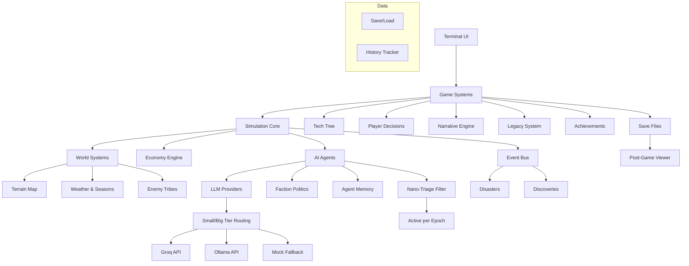

<h1 align="center">🏛️ Civilization Engine</h1>

<p align="center">
  <strong>v1.1</strong> — <em>Multi-agent AI civilization simulator with post-game timeline viewer</em>
</p>

<p align="center">
  
  
  
  
  
</p>

<p align="center">
  <em>Terminal-based multi-agent civilization simulation with emergent research, discovery, and post-game causal analysis</em>
</p>

<br>

<p align="center">
  <a href="#screenshots">📸 Screenshots</a> ·
  <a href="#quick-start">🚀 Quick Start</a> ·
  <a href="#gameplay">🎮 Gameplay</a> ·
  <a href="#features">✨ Features</a> ·
  <a href="#scenarios">🌍 Scenarios</a> ·
  <a href="#viewer">📊 Timeline Viewer</a> ·
  <a href="#large-scale-mode">🏘️ Large Scale Mode</a>
</p>

<br>

---

## 📸 Screenshots

<p align="center">
  
  
</p>
<p align="center">
  <em>Left: Council decisions shape your civilization's fate · Right: Seasonal epoch display with dynamic terrain map</em>
</p>

<br>

<p align="center">
  
  
</p>
<p align="center">
  <em>Left: Agents converse with emotions and opinions · Right: Full civilization chronicles at game end</em>
</p>

<br>

<p align="center">
  
  
</p>
<p align="center">
  <em>Left: Breaking news popup for major discoveries · Right: The Civilization Times newspaper</em>
</p>

```
  +------------------------------------------+
  |         CIVILIZATION ENGINE v1.0         |
  |    AI agents . Interactive . Terminal    |
  +------------------------------------------+

  Year 8/20    Bronze Age    Summer
  Pop: 134     Discoveries: 3

  Kael . Doren . Mira . Thane . Elara

  Food  ###########..  84
  Wood  ####........   42
  Stone ######......   63

  Innovators  24    Scholars  19
  Builders    14    Threat    55%

  + Agriculture discovered
  ! Raid -- Grey Wolves attack! Lost 8
  > Kael asks: "Can we channel the river?"
```

## Overview

**Civilization Engine** is an interactive AI simulation where a population of agents — each with unique personalities, expertise, and goals — build a society from scratch through emergent research and discovery. You don't just watch. Every few years, you sit on the Council of Elders and make decisions that shape your civilization's fate.

Will you invest in agriculture to stave off famine? Fortify defenses against raiding tribes? Fund research to discover bronze-working? Or crush a rival faction before they grow too powerful?

Your choices echo across generations. After the game ends, you can open the **companion timeline viewer** to scrub through epochs, explore the causal graph of discoveries, and ask the oracle "why did X happen?" or "what if Y had changed?".

Runs on free-tier LLMs (Groq, Ollama) with zero-config mock fallback — no API keys required.

## Quick Start

```bash
# Clone and install
git clone https://github.com/sciencebanda09/Civilization-Engine.git
cd Civilization-Engine
npm install

# Play with the interactive scenario picker
npm run play

# Or launch directly with a scenario and epoch count
npm run play -- peaceful_valley 10

# Large-scale mode (50+ agents)
npm run play -- --agents 50 10

# Post-game timeline viewer (after saving a game)
npm run viewer

# Run the test suite (380+ assertions across 3 test files)
npm test
```

No API keys required. The simulation runs out of the box with built-in mock provider.

---

## Gameplay

### The Simulation Loop

Each **epoch** (year) advances through 4 **seasonal micro-epochs** — each with distinct weather, resource flows, and visual feedback:

| Season | Effect | Map Color | Player Sees |
|--------|--------|-----------|-------------|
| 🌸 **Spring** | Planting +10 food | Green | Agent chatter, council invites |
| ☀️ **Summer** | Growth or drought risk | Golden | Breaking news popups, wildfire warnings |
| 🍂 **Autumn** | Harvest +25 food, +15 wood | Orange | Event cascades, dynasty updates |
| ❄️ **Winter** | Scarcity −15 food, −5 wood | White | Disaster rolls, end-of-year newspaper |

Between seasons, **agents converse** — they argue, agree, gossip, and react to recent events based on their personalities and opinions of each other. You can press **[T]** to talk to any agent mid-epoch, **[D]** to issue an urgent decree, or **[H]** to browse history.

### Core Systems Tick

1. **Economy** — Resources are produced and consumed through supply chains. Population grows or starves.
2. **Disasters** — Floods, droughts, plagues, raids, and earthquakes can strike at any moment.
3. **Event Cascades** — Events chain into narratives (drought → famine → blame → revolt) across multiple seasons.
4. **Agent Actions** — AI agents triage, form teams, debate hypotheses, and make discoveries.
5. **Faction Update** — Influence shifts based on events and agent reputations.
6. **Civilization Diplomacy** — Autonomous civilizations trade, ally, spy, and declare war.
7. **Religion & Culture** — Faiths emerge from events, traditions form, holy sites are declared.

### Interactive Decisions

The simulation pauses for you at critical moments:

| Decision | Trigger | What You Choose |
|----------|---------|----------------|
| **Council of Elders** | Every 4 epochs | A strategic focus: Food Production, Military Defense, Scientific Research, Territorial Expansion, Foreign Trade, Warfare, or Diplomatic Outreach |
| **Crisis Response** | When disaster strikes | A course of action — play it safe, gamble on a bold solution, or exploit the situation |
| **Tech Direction** | When a discovery is near | Nudge scholars toward a specific field |

Each choice has real consequences. Boost defense too early and your economy may stagnate. Neglect research and enemy tribes will outpace you.

### Example: Council Decision

```
  +--------------------------------------------+
  |  The Council of Elders convenes...         |
  |                                            |
  |  "The river floods our southern fields.    |
  |   Half the grain stores are ruined.        |
  |   What should we do, elder?"               |
  |                                            |
  |  [1] Build levees -- secure next harvest   |
  |  [2] Send expeditions south -- find land   |
  |  [3] Ration food -- weather the storm      |
  |  [4] Blame the Builders -- consolidate     |
  |       power                                |
  +--------------------------------------------+
```

### Example: Crisis Response

```
  +--------------------------------------------+
  |  DROUGHT has struck the valley!            |
  |                                            |
  |  "The wells have run dry. Crops are        |
  |   withering. The elders are panicking."    |
  |                                            |
  |  [1] Dig deeper wells -- safe, steady      |
  |  [2] Sacrifice to the ancestors -- risky,  |
  |       high reward                          |
  |  [3] Raid the Grey Wolves' oasis --        |
  |       dangerous, fills granaries           |
  +--------------------------------------------+
```

---

## Scenarios

Six built-in scenarios plus an auto-generated large mode:

| Scenario | Difficulty | Agents | Starting Era | Description |
|----------|-----------|--------|-------------|-------------|
| `peaceful_valley` | Easy | 5 | Stone Age | A lush valley with abundant resources. Perfect for learning the mechanics. |
| `rich_valley` | Normal | 5 | Stone Age | Fertile valley with booming population. Rapid growth brings new problems. |
| `island_colony` | Normal | 3 | Stone Age | A small island far from any mainland. No escape. No help. |
| `desert_oasis` | Hard | 3 | Stone Age | A tiny oasis in a vast desert. Water and wood are precious. |
| `volcanic_winter` | Hard | 3 | Stone Age | The sun is blotted out. Crops freeze. Survival is everything. |
| `iron_fist` | Extreme | 5 | Iron Age | Oppression. Slavery. You start with iron and a hunger for freedom. |
| `--agents N` | Normal | N (any) | Stone Age | Auto-generates N agents with diverse archetypes. Triage filters out most per epoch. |

---

## 📊 Viewer (Post-Game Timeline)

After playing a game (or loading a saved one), launch the companion web viewer:

```bash
npm run viewer
```

Opens a local HTTP server at `http://localhost:3030` that reads from the `saves/` directory. Features:

- **Horizontal timeline** — Scrollable epoch-by-epoch view with population and discovery density.
- **Epoch details** — Click any epoch to see its events, discoveries, and active research.
- **Causal graph** — Click a discovery to render an SVG node/edge diagram of which prior discoveries enabled it, which agents were involved, and what it unlocked.
- **Ask Why** — Type a question like "why did Agriculture take so long to discover?" and the oracle answers using the actual playthrough's causal subgraph.
- **What If** — Type a counterfactual like "what if we had prioritized defense over farming?" to project a divergent alternate timeline.

The viewer is a post-hoc inspection tool — it reads completed game saves, doesn't connect to a live game.

---

## 🏘️ Large-Scale Mode

Run simulations with 30–100+ agents using the `--agents` flag:

```bash
npm run play -- --agents 50 10
```

Key design for scale:

- **Bounded LLM budget** — Only `agentsPerEpochActive` (default 5) agents pass through nano-triage per epoch. Idle agents make zero LLM calls. Configurable `MAX_ACTIVE_TEAMS_PER_EPOCH` (default 3) caps concurrent research teams.
- **Batched factions** — With >10 agents, the system creates 4 broad factions and distributes agents among them (rather than one faction per agent).
- **Condensed UI** — Large populations display as "134 villagers, 6 active researchers, 128 idle" rather than listing every agent name. Only the top few notables are shown.

A run with 50 agents uses approximately the same per-epoch LLM call budget as a 5-agent run — the extra agents just increase the idle pool.

---

## Technology Tree

28 technologies spanning 4 eras. Each discovery unlocks new capabilities and requires specific prerequisites — for example, Bronze requires both Copper AND Tin smelting plus Trade routes.

```
  Stone Age         Copper Age        Bronze Age        Iron Age
  ----------        ----------        ----------        --------
  Fire              Smelting          Bronze Smithing   Iron Smelt
  Stone Tools       Copper Tools      Adv. Weapons      Steel Making
  Shelter           Irrigation        Chariots          Engineering
  Hunting           Animal Domes.     Writing           Philosophy
  Gathering         Pottery           Mathematics       Law
  Clothing          Weaving           Astronomy         Medicine
  Farming           Trade
  Language                                      +------ WIN CONDITION
  Basic Construction                            |    Reach Iron Age
                                                 +--  Population > 80
```

Technologies have prerequisites. You can't research Bronze Smithing without first discovering Smelting and Copper Tools. The tech tree is visible in-game and updates as discoveries are made.

---

## ✨ Features

### Dynamic Agent Personalities
Each agent has a persistent personality (trust, optimism, risk tolerance, political leaning) that shapes their behavior. Traits evolve through trauma (disasters reduce trust) and victory (discoveries boost optimism). Agent names in the UI are color-coded by trust level.

### Natural Language Chatter
Agents converse with each other every season using the built-in conversation engine. Dialogue reflects their relationship (allies are warm, rivals are hostile) and reacts to current events — droughts trigger worried exchanges, discoveries spark excitement.

### Breaking News Popups
Major events trigger full-screen news cards:
- **Discoveries** → Green ASCII art with quote
- **Wars/Raids** → Red alert with crossed swords
- **Disasters** → Hazard warning with skull icon
- **Era Advancements** → Gold bordered with star

### Event Cascades
Events chain into multi-season narratives:
```
Drought → Food < 30 → Famine → Agents blame each other → Trust drops → Revolt
Discovery → Economic boom → Population growth + trade surplus
Victory → Confidence surge → Defense boost + population increase
```

### Emergent Religions & Culture
Religions spawn from major events (disasters create "Sky Worship," discoveries create "The Way of Knowing"). Cultural traditions emerge independently (Harvest Festival, Ancestor Night, Warrior Coming of Age). Faiths grow followers, declare holy sites, and can undergo schisms.

### Autonomous Civilizations
Independent AI civilizations spawn at map edges with distinct archetypes (tribal, merchant, militarist, scholar, nomad). They form diplomacy states: neutral → friendly → allied (or hostile → war), establish trade routes, send tribute, and conduct espionage.

### Dynasty System
Agents belong to family lines. Achievements build dynastic reputation that carries across generations. The end-game report shows each dynasty's living members, dead members, and known accomplishments.

### Climate & Environment
Population growth drives CO₂ rise, temperature increase, deforestation, and pollution. Cross environmental thresholds to trigger climate events. The dynamic map shows deforestation visually.

### History Book & Newspapers
Every major event is recorded in the **History Book** (viewable mid-game with [H]). Every 5 years, **The Civilization Times** newspaper prints with sections: Front Page, Science & Discovery, Society, Market Report, and Historical Reflection.

---

## Factions & Politics

Agents don't work in harmony. They form factions based on their personalities and goals:

- **Innovators** — Driven by discovery and progress (inventors, explorers)
- **Scholars** — Value knowledge and preservation (scholars, sages)
- **Builders** — Focus on infrastructure and defense (crafters, leaders)
- **Militarists** — Believe in strength through conquest (warriors)

Factions gain and lose influence based on events, discoveries, and your council decisions. A faction with high influence can accelerate research in their field — but neglected factions may sow dissent or even attempt a coup.

---

## World Systems

### Terrain Map

A procedurally generated 20×6 world with rivers, forests, mountains, and settlements. The map evolves as your civilization builds and expands.

```
  ~~TT~~T^TT~~TT##TT~~
  ~TTTTTT^TTT~TTT#TT~~
  ~~TTTTTTT^^~TTTTTT~~
```

### Weather & Seasons

The world cycles through **4 seasons per year**, each rendered with distinct terrain colors:

- **🌸 Spring** — Planting: +10 food, heavy rains bring abundance, dry springs hinder sowing
- **☀️ Summer** — Growth or drought: normal years +10 food, droughts −12 food, heat waves −8 food
- **🍂 Autumn** — Harvest: +25 food, +15 wood, +5 stone — the most productive season
- **❄️ Winter** — Scarcity: −15 food (or −30 in bitter cold), −5 wood, no growth

The dynamic map reflects all of this — terrain changes color per season, drought browns the land, deforestation turns forest to plains, wildfires flicker with animated `F` tiles, and walls grow visually thicker as you fortify.

### Climate System

Population growth drives measurable climate change:
- **CO₂** rises from 280 ppm baseline with population
- **Temperature** increases with CO₂
- **Deforestation** spreads as the settlement expands
- **Pollution** accumulates with industry

Cross thresholds to trigger climate events: droughts, soil erosion, and heat waves.

### Enemy Tribes

Hostile tribes lurk beyond your borders. They raid, scout, and trade based on their hostility level. Successful raids cost you villagers and resources. Strong defenses deter them — but provoke larger assaults.

```
  ! Raid -- Grey Wolves attacked!
    Defender: Mira (explorer) fought back
    Damage: 12   Lost: 8 villagers
    The Grey Wolves retreat with stolen food.

  Enemy taunts:
    "Your walls are twigs. We will feast tonight."
```

---

## Achievements & Legacy

### 10 Achievements

Earned across all playthroughs:

| Achievement | Requirement |
|------------|------------|
| First Steps | Complete 5 epochs |
| Bronze Age | Reach the Bronze Age |
| Iron Age | Reach the Iron Age |
| Population Boom | Reach 150 population |
| Scholar | Discover 10 technologies |
| Defender | Win 10 raids |
| Explorer | Try 4 different scenarios |
| Silver Tongue | Resolve 10 crises peacefully |
| Conqueror | Win a game |
| Survivor | Survive past epoch 20 |

### Legacy System

Heroes from each run are recorded as legends. Their achievements — discoveries made, battles won, crises averted — become part of your civilization's mythology. Start a new game and your former heroes appear in the narrative as ancestral figures.

---

## Commands

| Command | Description |
|---------|-------------|
| `npm run play` | Launch interactive game with scenario picker |
| `npm run play -- <scenario> <epochs>` | Direct launch, skips picker |
| `npm run play -- --agents <N> <epochs>` | Large-scale mode with N auto-generated agents |
| `npm run viewer` | Launch post-game timeline viewer (http://localhost:3030) |
| `npm run analyze` | Run multiple simulations for statistical comparison |
| `npm test` | Run end-to-end integration test suite (380+ assertions) |
| `npm run lint` | Type-check the codebase (`tsc --noEmit`) |

### Examples

```bash
# Classic start, 10 years
npm run play -- peaceful_valley 10

# Large-scale simulation with 50 agents, 10 epochs
npm run play -- --agents 50 10

# Survival challenge, 20 years
npm run play -- volcanic_winter 20

# Extreme mode, 15 years
npm run play -- iron_fist 15

# Post-game timeline viewer
npm run viewer

# Batch analysis (runs 10 simulations)
npm run analyze
```

---

## Configuration

### Two-Tier Model Setup (Optional)

The simulation supports separate model tiers for cheap/fast vs. expensive/smart LLM calls:

| Tier | Used For | Recommended Groq Model | Recommended Ollama Model |
|------|----------|----------------------|----------------------|
| **Small** (cheap) | Nano-triage, epoch narration | `llama-3.1-8b-instant` | `qwen2.5:7b` |
| **Big** (smart) | Hypothesis generation, debate, adjudication, oracle | `llama-3.3-70b-versatile` | `qwen2.5:14b` |

Set both tiers in `.env`:

```env
GROQ_API_KEY=gsk_your_key_here
GROQ_SMALL_MODEL=llama-3.1-8b-instant
GROQ_BIG_MODEL=llama-3.3-70b-versatile
```

If only one model is configured (or the legacy `GROQ_MODEL`), both tiers fall back to that single model. The simulation works with zero config.

### Ollama (Local / Colab)

Uncomment in `.env` to use a local Ollama instance instead of Groq:

```env
OLLAMA_HOST=http://localhost:11434
OLLAMA_SMALL_MODEL=qwen2.5:7b
OLLAMA_BIG_MODEL=qwen2.5:14b
```

### Environment Variables

| Variable | Default | Description |
|----------|---------|-------------|
| `GROQ_API_KEY` | — | Groq API key (add 2-4 for load balancing) |
| `GROQ_SMALL_MODEL` | `llama-3.1-8b-instant` | Model for cheap/fast LLM calls |
| `GROQ_BIG_MODEL` | `llama-3.3-70b-versatile` | Model for expensive/smart LLM calls |
| `GROQ_MODEL` | `llama-3.3-70b-versatile` | Legacy single-model setting (fallback) |
| `OLLAMA_HOST` | `http://localhost:11434` | Ollama server URL |
| `OLLAMA_SMALL_MODEL` | `llama3.2` | Ollama small model tag |
| `OLLAMA_BIG_MODEL` | `llama3.2` | Ollama big model tag |
| `VIEWER_PORT` | `3030` | Port for the timeline viewer server |
| `LOG_LEVEL` | `info` | Log verbosity: `info`, `debug`, `warn`, `error`, `none` |

> No API keys are required. The simulation runs with a built-in mock provider without any configuration.

---

## Architecture



```
Civilization-Engine/
├── src/
│   ├── ui/                   # Terminal rendering: ANSI toolkit, chatter box, news popups
│   ├── game/                 # Game systems: decisions, tech tree, win/loss, game-session, dynasty
│   ├── simulation/           # Core loop: orchestrator (CountingLLMProvider), economy, disasters
│   ├── factions/             # Faction politics: rivalries, influence tracking
│   ├── map/                  # Procedural terrain, dynamic seasonal renderer, resource deposits
│   ├── world/                # Weather/seasons, enemy tribes, autonomous civilizations, religion
│   ├── scenarios/            # 6 scenarios + generateLargeScenario(n) for --agents mode
│   ├── narrative/            # Story engine, history book, newspapers, agent portraits
│   ├── llm/                  # Groq, Ollama, mock providers + small/big tier routing
│   ├── prompts/              # LLM prompt templates for agents, oracle, triage
│   ├── agents/               # Agent personalities, opinions, conversation, memory
│   ├── oracle/               # Causal analysis and counterfactual engine
│   ├── events/               # Event bus for internal messaging
│   ├── types/                # TypeScript type definitions (agent, world, experiment)
│   ├── utils/                # JSON parser, logger
│   └── index.ts              # Barrel exports (60+ public APIs)
├── viewer/
│   ├── server.ts             # HTTP server: save listing, timeline, causal graph, why/what-if
│   └── index.html            # Single-page timeline viewer with SVG causal graph
├── examples/
│   ├── play.ts               # Interactive CLI game (--agents N flag, 4-season micro-epoch loop)
│   └── analyze.ts            # Multi-run statistical analyzer
├── tests/
│   ├── e2e.test.ts           # 93-assertion end-to-end integration test
│   ├── scale.test.ts         # 269-assertion large-population scaling test
│   └── viewer.test.ts        # 18-assertion viewer API test
├── assets/                   # Screenshots
├── .github/                  # Issue templates, PR template
├── .env.example              # Documents SMALL_MODEL / BIG_MODEL env vars
├── CHANGELOG.md
├── CODE_OF_CONDUCT.md
├── CONTRIBUTING.md
└── LICENSE
```

### Technology Stack

| Component | Tech |
|-----------|------|
| Runtime | Node.js 18+ |
| Language | TypeScript 5.6 (strict mode) |
| LLM Providers | Groq, Ollama, Mock (no-keys-required fallback) |
| Dependencies | `dotenv` |
| Dev Tools | `tsx` (runner), `typescript` |

---

## Testing

```bash
# Run all test suites (380+ assertions across 3 test files)
npm test
npx tsx tests/scale.test.ts
npx tsx tests/viewer.test.ts
```

The test suite validates:
- GameSession creation with all integrated systems
- Agent personalities (trust, optimism, risk tolerance, age)
- Agent opinions and stances
- Full simulation running 10 epochs
- History Book recording and printing
- Newspaper generation and formatting
- Religion and cultural tradition spawning
- Dynasty tracking and summary
- Civilization diplomacy, trade, and espionage
- Climate system (CO₂, temperature, deforestation)
- Agent aging over time
- Dynamic map rendering (seasonal colors, drought, fire warnings)
- News popup category detection and body building
- Agent chatter generation (with emotions)
- Event cascade engine (chained narratives)
- Personality trauma recording
- **Large-population scaling** (50-agent scenario, faction batching, team caps, LLM call tracking)
- **Viewer API endpoints** (causal graph building, timeline construction, save reading)

---

## Requirements

- **Node.js** 18 or later
- **npm** (ships with Node)

Windows, macOS, and Linux are all supported.

---

## Contributing

See [CONTRIBUTING.md](./CONTRIBUTING.md) for guidelines.

---

## Changelog

See [CHANGELOG.md](./CHANGELOG.md) for version history.

---

## License

MIT. See [LICENSE](./LICENSE) for details.

---

<p align="center">
  <sub>Built for the terminal. Post-game viewer included. Just pure simulation.</sub>
</p>
